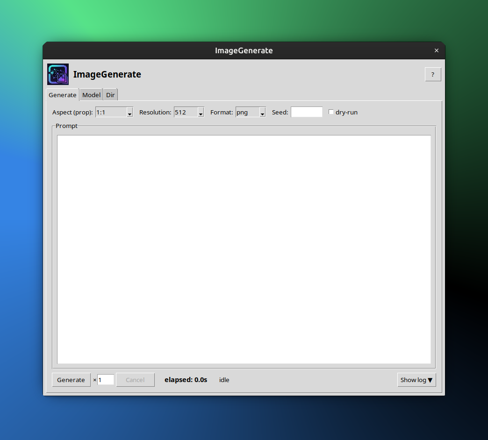
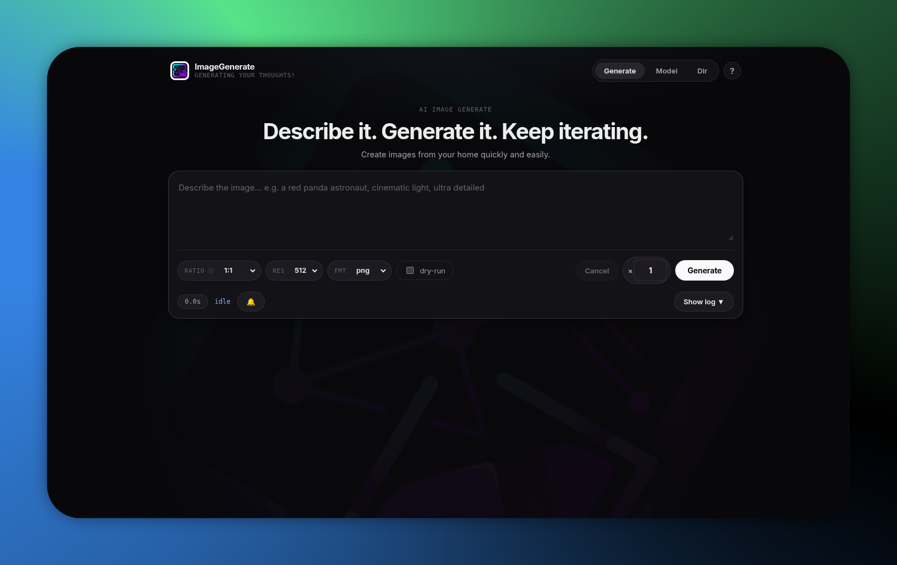

# <p align="center"></p> ImageGenerate

Gere imagens com IA sem esforço nem código: digite o prompt + dê contexto e referências se precisar → imagem gerada 🖼️


# 🎯 Funcionalidade

- **Gera imagens a partir de prompt** — digite o que quer ver, receba a imagem.
- **Gera imagens a partir de imagens** — use referências visuais (`--memory-dir`) para manter estilo/personagem.
- **Gera imagens em loop** — `--count 3` (até 10) com o mesmo prompt.
- **Controla a temperatura do modelo usado** — `--temperature 0.7`.
- **Escolhe modelo, proporção, resolução, formato** — `meta/muse-image`, `1:1` a `21:9`, `512` a `4K`, `png`/`jpeg`/`webp`.
- **Salva log das requisições** — `log_image_generate.csv`.
- **Teste offline** — `--dry-run` escreve placeholder sem chave, sem gasto.
- **Três interfaces, um núcleo** — CLI, GUI (Tkinter) e Web (React + FastAPI) usam o core.
- **Documentação completa local** — [`docs.html`](docs.html) abre direto no navegador, sem internet.

---

# ❓ Como instalar (do zero até pronto)

1. **Instale o Python 3.10+**:
```bash
sudo apt update
sudo apt install python3.11 -y
```

2. **Instale a dependência de cofre**:
```bash
pip install cryptography
```

3. **Para a versão web**:
```bash
pip install -r web/requirements.txt`
cd web/frontend
npm install
npm run build
```

4. **Para o launcher Linux**:
Gera o `.desktop`; podendo ser aberto pelo menu.
```bash
bash install.sh
```

---

# 🔒 3 modos de uso em um só lugar, tudo local

## 🖥️ Versão GUI (Tkinter)

Rode com:
```bash
python3 image_generate.py --gui
```
Ou iniciando **image-generate.desktop** (launcher gerado pelo install.sh).

<p align="center"></p>

## 🌐 Versão web

Sirva com com `server.py` e acesse em `http://127.0.0.1:8000`.

```bash
python3 web/server.py   # abre http://127.0.0.1:8000
```

<p align="center"></p>

## 🧑‍💻 Versão CLI (terminal)

Exemplos:
```bash
# Básico (sem chave, só dry-run)
python3 image_generate.py --prompt "teste" --prop 1:1 --resolution 512 --dry-run

# Com chave
export OPENROUTER_API_KEY="sk-or-..."
python3 image_generate.py --prompt "uma arara voando" --prop 16:9 --resolution 1K --count 3 --temperature 0.7

# Ver histórico
python3 image_generate.py --list-log
```

---

# 📚 Documentação completa

O arquivo [`docs.html`](docs.html) é a documentação completa do programa — não precisa de internet, abre direto no navegador. Use a busca no topo para encontrar rapidamente o que precisa.
