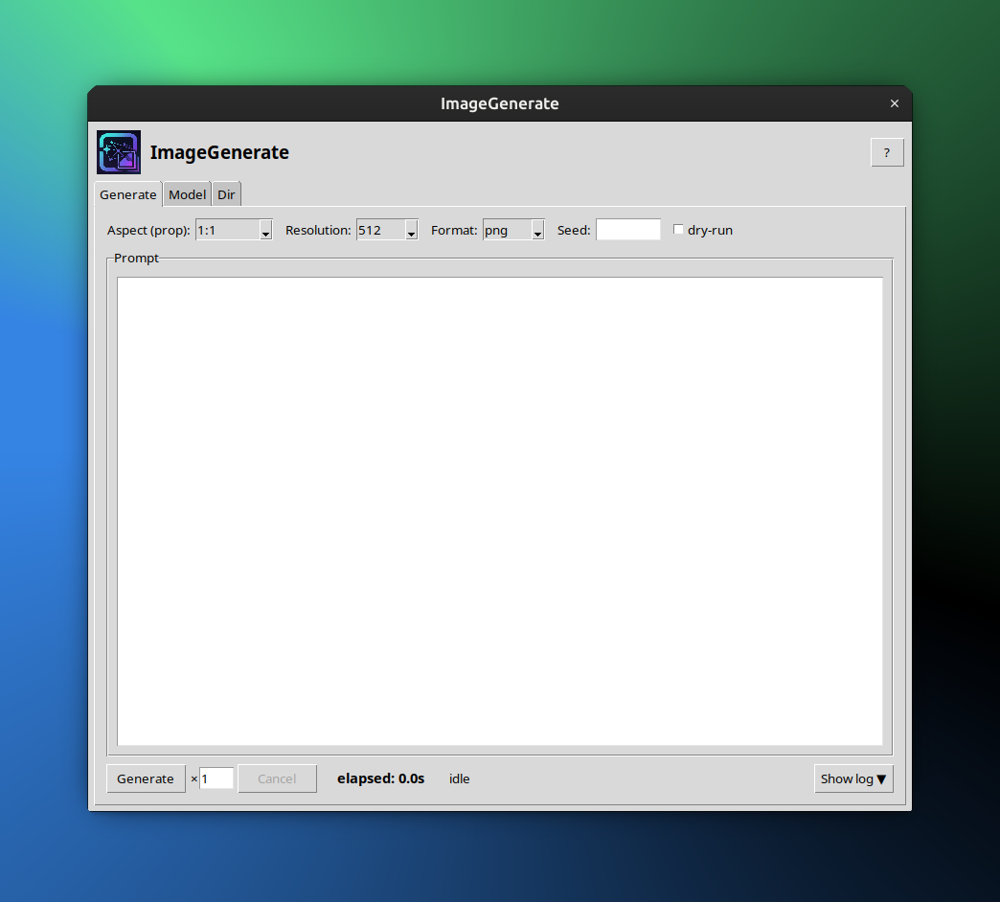
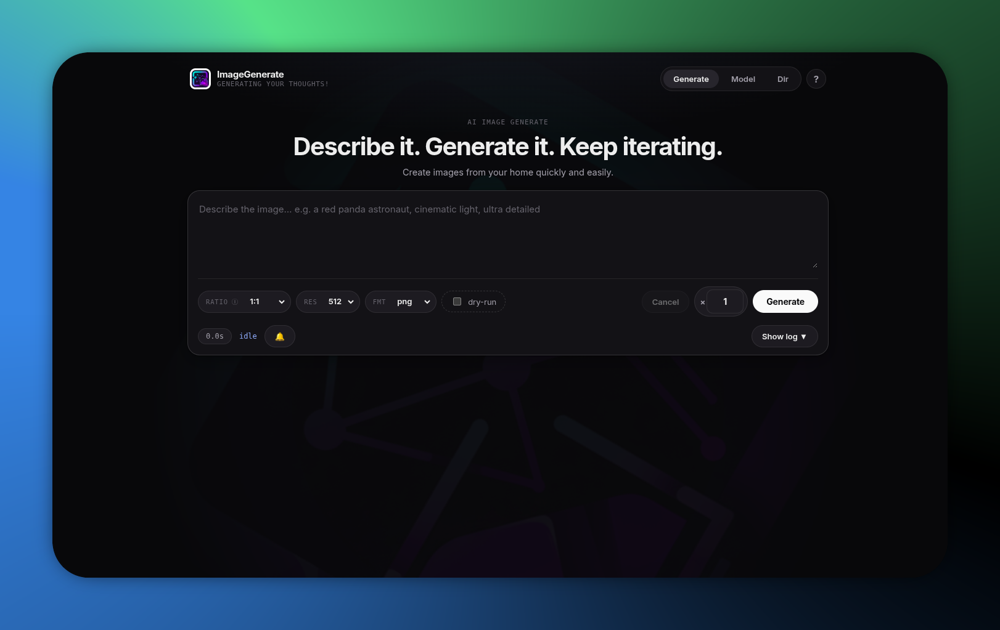

# <p align="center"></p> ImageGenerate

Gere imagens com IA sem esforço nem código: digite o prompt + dê contexto e referências se precisar → imagem gerada 🖼️
E transforme storyboards em histórias narradas com o **StoryGenerate** 🎙️


# 🎯 Funcionalidade

- **Gera imagens a partir de prompt** — digite o que quer ver, receba a imagem.
- **Gera imagens a partir de imagens** — use referências visuais (`--memory-dir`) para manter estilo/personagem.
- **Gera imagens em loop** — `--count 3` (até 30) com o mesmo prompt; acima de 10, o pedido é dividido em chamadas de até 10 imagens automaticamente.
- **Pastas dinâmicas (Dynamic)** — com n > 1, marque *Dynamic* abaixo de Output/Context/Memory dir e informe *Start* (padrão 1), *Range* (última pasta) e *Batch* (gerações por pasta, padrão 1): as gerações usam `<pasta>/<Start>` … `<pasta>/<Range>`, *Batch* seguidas em cada pasta, e voltam ao Start. Ex.: Start 2, Range 12, Batch 3 → gerações 1–3 na pasta 2, 4–6 na 3, 7–9 na 4… CLI: `--dynamic-output 12 --dynamic-output-start 2 --dynamic-output-batch 3`.
- **Comparar e escolher (Analyse)** — aba que mostra várias pastas lado a lado (linha N = N-ésima imagem mais recente de cada pasta, ⇅ inverte, Zoom −/+, prévia grande ao parar o mouse sobre a imagem — o maior tamanho que cabe ao lado do cursor), você seleciona 1 imagem por linha e **Choose** copia as escolhidas para `chosen/<data_hora>/` (por padrão na pasta-mãe do Output dir, ao lado das pastas comparadas) com relatório (`report.md` + `report.csv`: origem, prompt, modelo, seed e contra quais imagens cada uma venceu). CLI: `--analyse A --analyse B --choose 1:2`.
- **Variáveis no prompt (Injection)** — use `{{nome}}` no prompt e preencha os valores por geração: aba amarela **Injection** na GUI/web ou `--inject 'pessoa=menino,objeto=sorvete'` no CLI (uma opção por geração).
- **Escolhe modelo, proporção, resolução, formato** — `provider/model`, `1:1` a `21:9`, `512` a `4K`, `png`/`jpeg`/`webp`.
- **Salva log das requisições** — `log_image_generate.csv`, mostrado da mais nova para a mais velha e atualizado a cada imagem (botão direito → *Use prompt*).
- **Ordenar e filtrar a lista (nas duas GUIs)** — clique no cabeçalho para ordenar; botão direito no cabeçalho abre um filtro estilo planilha (valores com contagem, “contém…”). CLI: `--list-log --log-filter model=muse --log-sort cost_usd:desc`.
- **Lembra de tudo** — pastas, modelos, opções e o **último prompt** voltam ao reabrir a GUI.
- **Browse inteligente** — abre na pasta digitada; se ela não existir, avisa e abre na pasta-mãe mais próxima.
- **Teste offline** — `--dry-run` escreve placeholder sem chave, sem gasto.
- **Três interfaces, um núcleo** — CLI, GUI (Tkinter) e Web (React + FastAPI) usam o core.
- **Ajuda sempre à mão** — botão **?** nas duas GUIs abre a [`docs.html`](docs.html) (local, sem internet); passe o mouse sobre os campos para ver dicas.

---

# ❓ Como instalar

1. **Instale o Python 3.10+**:
```bash
sudo apt update
sudo apt install python3.11 -y
```

2. **Instale a dependência de cofre**:
```bash
pip install cryptography
```

3. **Para a versão web**:
```bash
pip install -r web/requirements.txt
cd web/frontend
npm install
npm run build
```

4. **Para os launchers Linux** (menu de aplicativos):
```bash
bash install.sh               # pergunta se instala também o StoryGenerate
bash install.sh --with-story  # instala os dois sem perguntar
```
Rode **sem `sudo`** (o instalador é por usuário e recusa rodar como root). Ele só cria lançadores e ícones — não mexe nas suas configurações nem chaves; pode rodar de novo quando quiser.

5. **Opcional:** `sudo apt install imagemagick` (miniaturas JPEG/WebP na aba Analyse) e `alsa-utils` (`aplay`, player do StoryGenerate) — normalmente já vêm instalados.

---

# 🔒 3 modos de uso em um só lugar, tudo local

## 🖥️ Versão GUI (Tkinter)

Rode com:
```bash
python3 image_generate.py --gui
```
Ou pelo launcher **ImageGenerate** no menu (criado pelo `install.sh`). Abas: **Generate**, **Model**, **Dir**, **Analyse** e **Injection** (só aparece quando o prompt tem `{{variáveis}}` e n > 1).

<p align="center"></p>

## 🌐 Versão web

Sirva com `server.py` e acesse em `http://127.0.0.1:8000`.

```bash
python3 web/server.py   # abre http://127.0.0.1:8000
```

<p align="center"></p>

## 🧑‍💻 Versão CLI (terminal)

Exemplos:
```bash
# Básico (sem chave, só dry-run)
python3 image_generate.py --prompt "teste" --prop 1:1 --resolution 512 --dry-run

# Com chave
export OPENROUTER_API_KEY="sk-or-..."
python3 image_generate.py --prompt "uma arara voando" --prop 16:9 --resolution 1K --count 3

# Variáveis no prompt (Injection) — uma opção por geração
python3 image_generate.py --prompt "crie uma imagem de um {{pessoa}} com um {{objeto}}." \
  --inject "pessoa=menino,objeto=sorvete" \
  --inject "pessoa=cavalo,objeto=capacete" \
  --inject "pessoa=carro,objeto=palhaço"

# Comparar pastas e copiar as escolhidas (aba Analyse no terminal)
python3 image_generate.py --analyse ./modeloA --analyse ./modeloB
python3 image_generate.py --analyse ./modeloA --analyse ./modeloB --choose 1:2 --choose 2:1

# Ver histórico
python3 image_generate.py --list-log
```

---

# 🎙️ StoryGenerate (storyboard → história narrada)

`story_generate.py` recebe uma pasta de storyboards e, para cada imagem:

1. um **roteirista** (modelo com visão no OpenRouter; padrão `google/gemini-3.7-flash`) lê os quadros em ordem (esquerda → direita, cima → baixo), escreve uma cena por quadro com transições entre elas, dá um título curto e **escolhe a voz** mais adequada entre até 5 vozes do **Fish Audio**;
2. o **Fish Audio, via OpenRouter** (padrão `fish-audio/s2.1-pro-free:free`, grátis) narra cada cena com a voz escolhida — as cenas são unidas num só `audio.wav`, com uma pausa curta entre elas;
3. sai uma pasta `<título>/` com `storyboard.png`, `roteiro.md`, `audio.wav` e `story.json` (+ `log_story_generate.csv` na pasta de saída).

**Aba Generate:**
- escolha o **roteirista** — *Descritivo* (fiel ao que cada quadro mostra) ou *Narrativo* (foca nas transições: preenche o que aconteceu entre um quadro e o próximo);
- escolha a **duração** da narração (vazio = automático; ex.: `90`, `1:30`, `2m`), convertida em palavras pela velocidade real de cada voz medida nas suas histórias anteriores;
- a linha azul mostra o passo atual (enviando ao roteirista, narrando cena 3/6, tentando de novo após limite 429…) com um contador de segundos.

**Robustez do roteirista:**
- **cadeia de fallback** no campo Writer model (`qwen/qwen3.8-27b:free;google/gemini-3.7-flash`): se um modelo falhar, o próximo assume;
- limite de uso (429) → 3 novas tentativas (5/15/30 s);
- resposta vazia ou demora demais → a próxima tentativa **pensa um nível a menos**;
- antes do lote, confere se os modelos aceitam imagem.

**Log e lista:**
- falhas ficam **em vermelho** com o motivo: **Retry failed** refaz só elas (ou duplo clique / botão direito numa linha vermelha);
- botão direito: *Copy row*, *Open in Player*, *Open folder*, *Delete audio only…*, *Delete script + audio…* (para a Lixeira; o storyboard original nunca é tocado);
- texto grande aparece inteiro num balão ao parar o mouse na célula;
- ordene clicando no cabeçalho e filtre com o botão direito no cabeçalho (ex.: só *error*, só *muse 1*, só *Narrativo*); CLI: `--list-log --log-filter style=connective`;
- storyboards já transformados **no estilo selecionado** são pulados (mesmo conteúdo de imagem) para não gastar de novo — ter a versão Descritiva não impede gerar a Narrativa; *redo existing* refaz todos;
- a coluna *storyboards dir* mostra de qual pasta veio cada história.

**Aba Player:** a lista mostra cada história como *Título - pasta de storyboards - roteirista* (ex.: `O Livro Devolvido - muse 1 - Narrativo`); o player mostra o storyboard com o roteiro ao lado (arraste as divisórias para redimensionar lista, imagem e roteiro) e toca a história: ▶/⏸, ⏪ 10 s, 10 s ⏩, ⏮/⏭ cena, ⏹ e barra de busca; a cena atual fica destacada (clique numa cena para pular até ela; atalhos: espaço, ←/→, ↑/↓).

```bash
python3 story_generate.py --gui
python3 story_generate.py --input-dir ./storyboards --dry-run          # offline, sem custo
python3 story_generate.py --input-dir ./storyboards \
  --voice <voice_id_1>=narradora --voice <voice_id_2>=menino           # até 5 vozes
python3 story_generate.py --input-dir ./storyboards --style connective --duration 1:30 \
  --writer-model "qwen/qwen3.8-27b:free;google/gemini-3.7-flash"      # grátis com fallback pago
python3 story_generate.py --retry-failed                               # só os que falharam
python3 story_generate.py --check-voices --voice <voice_id>            # confere as vozes
python3 story_generate.py --play "~/Imagens/StoryGenerate/Um dia comum" # toca no terminal
python3 story_generate.py --delete "~/Imagens/StoryGenerate/Um dia comum" --audio-only
```

Chave: **uma só**, a do OpenRouter (a mesma do ImageGenerate, cofre compartilhado) — serve para o roteirista e para a narração; não precisa de conta no Fish Audio. O voice id é o código na URL da voz (`fish.audio/m/<id>`). Custo da narração: `:free` = 0; modelos pagos são consultados no OpenRouter logo depois de cada história (~15 s) e vão para `tts_cost_usd` no log.

---

# 📚 Documentação completa

O arquivo [`docs.html`](docs.html) é a documentação completa dos dois programas — não precisa de internet, abre direto no navegador (ou pelo botão **?** das GUIs). Use a busca no topo para encontrar rapidamente o que precisa.
